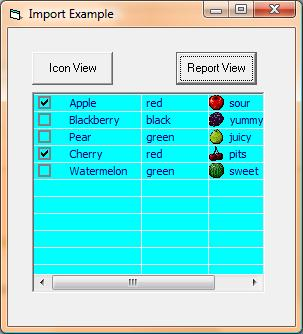



## FYI: Import/Export ListView \[16Feb09\]

### Description

Updated posted bad example in previous upload. For your personal use. A slightly different method of exporting/importing a ListView. When I said listview, I mean all that pertains to it: This includes listview properties, its column headers &amp; their props, its listitems &amp; their props, the listitems' subitems &amp; their props, the imagelists bound to the listview and its props, each image in the imagelist and its props. Additionally, you can pick and choose portions of what will be exported/imported. Note. The previous upload example for importing the reportview example did not ask to include control formatting, it should have. My mistake. No change to the class.
 
### More Info
 

             |
---                |---
**Submitted On**   |2009-02-16 20:02:10
**By**             |[LaVolpe](https://github.com/Planet-Source-Code/PSCIndex/blob/master/ByAuthor/lavolpe.md)
**Level**          |Intermediate
**User Rating**    |5.0 (10 globes from 2 users)
**Compatibility**  |VB 6\.0
**Category**       |[VB function enhancement](https://github.com/Planet-Source-Code/PSCIndex/blob/master/ByCategory/vb-function-enhancement__1-25.md)
**World**          |[Visual Basic](https://github.com/Planet-Source-Code/PSCIndex/blob/master/ByWorld/visual-basic.md)
**Archive File**   |[FYI\_\_Impor2144142162009\.zip](https://github.com/Planet-Source-Code/lavolpe-fyi-import-export-listview-16feb09__1-71774/archive/master.zip)

